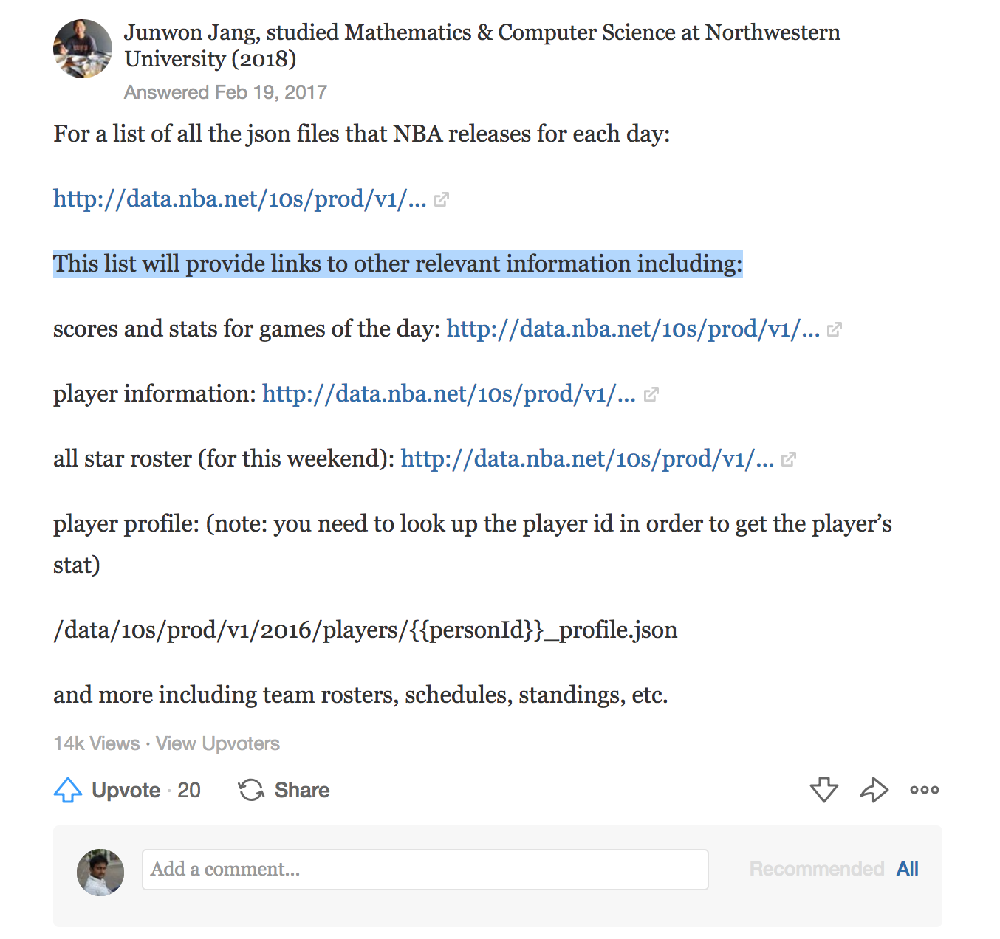

The point of view which you can bring to larger mass in adoption is an Idea

This is enjoy my game of data crunching and partly investment oriented skill set on long terms , I Love BasketBall, and to show how interesting this amazing organization is to build the future world sports , which is perfect and one sport contribution to the world by USA . its history is such marking the mirage of American growth as the world power for good reason - to keep people comptetitive in physical world.  :

<h2>Inspiration:
<p>
I watched a machine beating a man in alpha Go game , I realized it marked the machine taking over a man in 1 on 1 game. It was a mental game where it showed that Machines are only good at crunching numbers and giving a good probablitly of successful next move.

Machines are yet to beat a man in team game, but wait all these silicon valley teams are beating a Man in a realtime physical team game and that is LEBRON JAMES,
LEBRON JAMES if he had stayed in west and won a championship again there would have still been the hope that Machines have taken over this game too.

Here comes the interesting part, Lebron James moved to West and gave a hope of a different kind that is we can adopt the data and machines help to only prove that its Man who will be in fore front.

I want him to win many more championship -- he is the man (2018-2019)

To keep the inspiration going ,Financial motivation is one of the reason.

Currently its taken over by the machines where the
<h2> Sites to bet on NBA


<h2> Data Source:

<li>Consolidate List of Current Season Data fromfrom SOurce: <h3>http://data.nba.net/10s/prod/v1/today.json
```
{
   "showPlayoffsClinch": false,
   "links": {
      "anchorDate": "20181016",
      "currentDate": "20181016",
      "calendar": "/prod/v1/calendar.json",
      "todayScoreboard": "/prod/v1/20181016/scoreboard.json",
      "currentScoreboard": "/prod/v1/20181016/scoreboard.json",
      "scoreboard": "/prod/v2/{{gameDate}}/scoreboard.json",
      "teams": "/prod/v2/2018/teams.json",
      "leagueRosterPlayers": "/prod/v1/2018/players.json",
      "allstarRoster": "/prod/v1/allstar/2017/AS_roster.json",
      "leagueRosterCoaches": "/prod/v1/2018/coaches.json",
      "leagueSchedule": "/prod/v1/2018/schedule.json",
      "leagueConfStandings": "/prod/v2/current/standings_conference.json",
      "leagueDivStandings": "/prod/v2/current/standings_division.json",
      "leagueUngroupedStandings": "/prod/v2/current/standings_all.json",
      "leagueMiniStandings": "/prod/v1/current/standings_all_no_sort_keys.json",
      "leagueTeamStatsLeaders": "/prod/v1/2018/team_stats_rankings.json",
      "leagueLastFiveGameTeamStats": "/prod/v1/2018/team_stats_last_five_games.json",
      "previewArticle": "/prod/v1/{{gameDate}}/{{gameId}}_preview_article.json",
      "recapArticle": "/prod/v1/{{gameDate}}/{{gameId}}_recap_article.json",
      "gameBookPdf": "/prod/v1/{{gameDate}}/{{gameId}}_Book.pdf",
      "boxscore": "/prod/v1/{{gameDate}}/{{gameId}}_boxscore.json",
      "miniBoxscore": "/prod/v1/{{gameDate}}/{{gameId}}_mini_boxscore.json",
      "pbp": "/prod/v1/{{gameDate}}/{{gameId}}_pbp_{{periodNum}}.json",
      "leadTracker": "/prod/v1/{{gameDate}}/{{gameId}}_lead_tracker_{{periodNum}}.json",
      "playerGameLog": "/prod/v1/2018/players/{{personId}}_gamelog.json",
      "playerProfile": "/prod/v1/2018/players/{{personId}}_profile.json",
      "playerUberStats": "/prod/v1/2018/players/{{personId}}_uber_stats.json",
      "teamSchedule": "/prod/v1/2018/teams/{{teamUrlCode}}/schedule.json",
      "teamsConfig": "/prod/2018/teams_config.json",
      "teamRoster": "/prod/v1/2018/teams/{{teamUrlCode}}/roster.json",
      "teamsConfigYear": "/prod/{{seasonScheduleYear}}/teams_config.json",
      "teamScheduleYear": "/prod/v1/{{seasonScheduleYear}}/teams/{{teamUrlCode}}/schedule.json",
      "teamLeaders": "/prod/v1/2018/teams/{{teamUrlCode}}/leaders.json",
      "teamScheduleYear2": "/prod/v1/{{seasonScheduleYear}}/teams/{{teamId}}/schedule.json",
      "teamLeaders2": "/prod/v1/2018/teams/{{teamId}}/leaders.json",
      "playoffsBracket": "/prod/v1/2017/playoffsBracket.json",
      "playoffSeriesLeaders": "/prod/v1/2018/playoffs_{{seriesId}}_leaders.json"
   }
}
```
